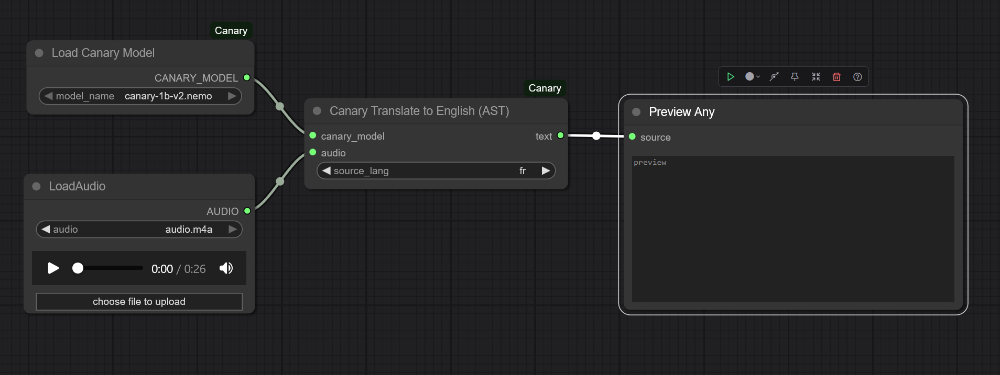

# Canary-ComfyUI

NVIDIA’s Canary is a state-of-the-art multilingual speech-to-text and speech-translation model (ASR + AST) offering punctuation and capitalization 
this ComfyUI custom node supports :
- canary-1b-v2, 
- canary-1b-flash, 
- canary-180m-flash.


<p align="center">
  
</p>


---


### Installation

Follow these steps to install and configure the nodes.

**1. Clone the Repository**

Navigate to your ComfyUI `custom_nodes` directory and clone this repository:
```bash
# Example path: ComfyUI/custom_nodes/
cd /path/to/your/ComfyUI/custom_nodes/
git https://github.com/Juste-Leo2/Canary-ComfyUI.git
cd Canary-ComfyUI
```

**2. Install Dependencies**

Python environments within ComfyUI can be tricky. The recommended way to install the required `nemo_toolkit` is by using `uv`, which is included with recent versions of ComfyUI.

Open a terminal or command prompt and run the following command. **You must replace `path/to/your/python.exe` with the actual path to the Python executable used by ComfyUI.**

*   For the **portable version of ComfyUI**, this is typically `ComfyUI/python_embeded/python.exe`.
*   If you use a **virtual environment (venv)**, activate it and use `python`.

```bash
# Command to run from the root of the Canary-ComfyUI folder
# (ComfyUI/custom_nodes/Canary-ComfyUI)
/path/to/your/python.exe -m uv pip install -r requirements.txt --no-deps --force-reinstall --index-strategy unsafe-best-match
```
This command uses `uv` to install NeMo in a way that is less likely to cause conflicts with ComfyUI's existing packages.

**3. Download the Model**

*   Go to the model's files page on Hugging Face: [nvidia/canary-1b-v2](https://huggingface.co/nvidia/canary-1b-v2/tree/main)
*   Download the model file, which is named `canary-1b-v2.nemo`.

**4. Place the Model**

*   Place the downloaded `canary-1b-v2.nemo` file inside the `ComfyUI/models/canary/` directory.
*   You may need to create the `canary` folder yourself if it doesn't exist.

The final path should look like this: `ComfyUI/models/canary/canary-1b-v2.nemo`.

**5. Restart ComfyUI**

Restart ComfyUI completely. The new nodes should appear in the "Add Node" menu under the `Canary-ComfyUI` category.

### Usage

1.  Add the `Load Canary Model` node and select `canary-1b-v2.nemo`.
2.  Add an audio loading node (e.g., `Load Audio`)
3.  Connect the `CANARY_MODEL` and `AUDIO` outputs to one of the three task nodes (`Canary Transcription`, `Canary Translate to English`, or `Canary Translate from English`).
4.  Select the desired languages and queue the prompt. The resulting text will be available as an output.

### Roadmap

Here are some of the features and improvements planned for the future of this project:

- [ ] Timestamp Support
- [x] Support for main SOTA Canary Models 
- [ ] Support canary-1b
- [ ] node fusion for simplified use

### License

*   The Python code in this repository is released under the **Apache 2.0 License**.
*   The NVIDIA Canary-1b-v2 model is subject to its own license, the **[Creative Commons Attribution-NonCommercial 4.0 International](https://huggingface.co/datasets/choosealicense/licenses/blob/main/markdown/cc-by-4.0.md)**. Please review its terms before use, especially regarding commercial applications.

### Acknowledgements

*   A big thank you to **NVIDIA** for creating and open-sourcing the [Canary model](https://huggingface.co/nvidia).
*   Thanks to the entire **[ComfyUI team](https://github.com/comfyanonymous/ComfyUI)** for building such a flexible and powerful tool for the community.